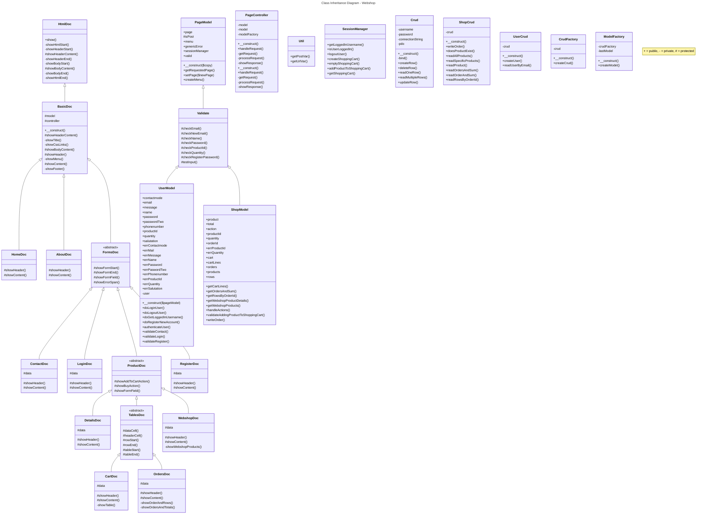

```mermaid
---
title: Class Inheritance Diagram - Webshop
---
classDiagram
    note "+ = public, - = private, # = protected"
    %% A <|-- B means that class B inherits from class A %%

    HtmlDoc <|-- BasicDoc

    BasicDoc <|-- HomeDoc
    BasicDoc <|-- AboutDoc
    BasicDoc <|-- FormsDoc

    FormsDoc <|-- ContactDoc
    FormsDoc <|-- LoginDoc
    FormsDoc <|-- ProductDoc
    FormsDoc <|-- RegisterDoc

    ProductDoc <|-- DetailsDoc
    ProductDoc <|-- TablesDoc
    ProductDoc <|-- WebshopDoc

    TablesDoc <|-- CartDoc
    TablesDoc <|-- OrdersDoc

    PageModel <|-- Validate
    Validate <|-- UserModel
    Validate <|-- ShopModel

    class PageController{
        -model

        +__construct()
        +handleRequest()       
        -getRequest()
        -processRequest()
        -showResponse()        
    }
    class PageModel{
        +page
        #isPost
        +menu
        +genericError
        +sessionManager
        +valid

        +__construct($copy)
        +getRequestedPage()
        +setPage($newPage)
        +createMenu()
    }
    class UserModel{
        +contactmode
        +email
        +message
        +name
        +password
        +passwordTwo
        +phonenumber
        +productId
        +quantity
        +salutation

        +errContactmode
        +errMail
        +errMessage
        +errName
        +errPassword
        +errPaswordTwo
        +errPhonenumber
        +errProductId
        +errQuantity
        +errSalutation

        -user

        +__construct($pageModel)
        +doLoginUser()
        +doLogoutUser()
        +doGetLoggedInUsername()
        +doRegisterNewAccount()
        +authenticateUser()
        +validateContact()
        +validateLogin()
        +validateRegister()
    }
    class ShopModel{
        +product
        +total
        +action
        +productId
        +quantity
        +orderId
        +errProductId
        +errQuantity
        +cart
        +cartLines
        +orders
        +products
        +rows

        +getCartLines()
        +getOrdersAndSum()
        +getRowsByOrderId()
        +getWebshopProductDetails()
        +getWebshopProducts()
        +handleActions()
        +validateAddingProductToShoppingCart()
        +writeOrder()
    }
    class Util{
        +getPostVar()
        +getUrlVar()
    }
    class Validate{
        #checkEmail()
        #checkNewEmail()
        #checkName()
        #checkPassword()
        #checkProductId()
        #checkQuantity()
        #checkRegisterPassword()
        #testInput()
    }
    class HtmlDoc{
       +show()
       -showHtmlStart()
       -showHeaderStart()
       #showHeaderContent()
       -showHeaderEnd()
       -showBodyStart()
       #showBodyContent()
       -showBodyEnd()
       -showHtmlEnd()
    }
    class BasicDoc{
        #model
        #controller
        +__construct()
        #showHeaderContent()
        -showTitle()
        -showCssLinks()
        #showBodyContent()
        #showHeader()
        -showMenu()
        #showContent()
        -showFooter()
    }
    class HomeDoc{
        #showHeader()
        #showContent()
    }
    class AboutDoc{
        #showHeader()
        #showContent()
    }
    class FormsDoc{
        <<abstract>>
        #showFormStart()
        #showFormEnd()
        #showFormField()
        #showErrorSpan()
    }
    class ProductDoc{
        <<abstract>>
        #showAddToCartAction()
        #showBuyAction()
        #showFormField()
    }
    class TablesDoc{
        <<abstract>>
        #dataCell()
        #headerCell()
        #rowStart()
        #rowEnd()
        #tableStart()
        #tableEnd()
    }
    class ContactDoc{
        #data
        #showHeader()
        #showContent()
    }
    class LoginDoc{
        #data
        #showHeader()
        #showContent()
    }
    class RegisterDoc{
        #data
        #showHeader()
        #showContent()
    }
    class CartDoc{
        #data
        #showHeader()
        #showContent()
        -showTable()
    }
    class OrdersDoc{
        #data
        #showHeader()
        #showContent()
        -showOrderAndRows()
        -showOrdersAndTotals()
    }
    class DetailsDoc{
        #data
        #showHeader()
        #showContent()
    }
    class WebshopDoc{
        #data
        #showHeader()
        #showContent()
        -showWebshopProducts()
    }
    class SessionManager{
        +getLoggedInUsername()
        +isUserLoggedIn()
        +logoutUser()
        +createShoppingCart()
        +emptyShoppingCart()
        +addProductToShoppingCart()
        +getShoppingCart()
    }
    class Crud{
        -username
        -password
        -connectionString
        -pdo
        +__construct()
        -bind()
        +createRow()
        +deleteRow()
        +readOneRow()
        +readMultipleRows()
        +updateRow()
    }
    class ShopCrud{
        -crud
        +__construct()
        +writeOrder()
        +doesProductExist()
        +readAllProducts()
        +readSpecificProducts()
        +readProduct()
        +readOrdersAndSum()
        +readOrderAndSum()
        +readRowsByOrderId()
    }
    class UserCrud{
        -crud
        +__construct()
        +createUser()
        +readUserByEmail()
    }
    class CrudFactory{
        -crud
        +__construct()
        +createCrud()
    }
    class ModelFactory{
        -crudFactory
        -lastModel
        +__construct()
        +createModel()
    }
    class PageController{
        -model
        -modelFactory
        +__construct()
        +handleRequest()
        -getRequest()
        -processRequest()
        -showResponse()
    }

```
