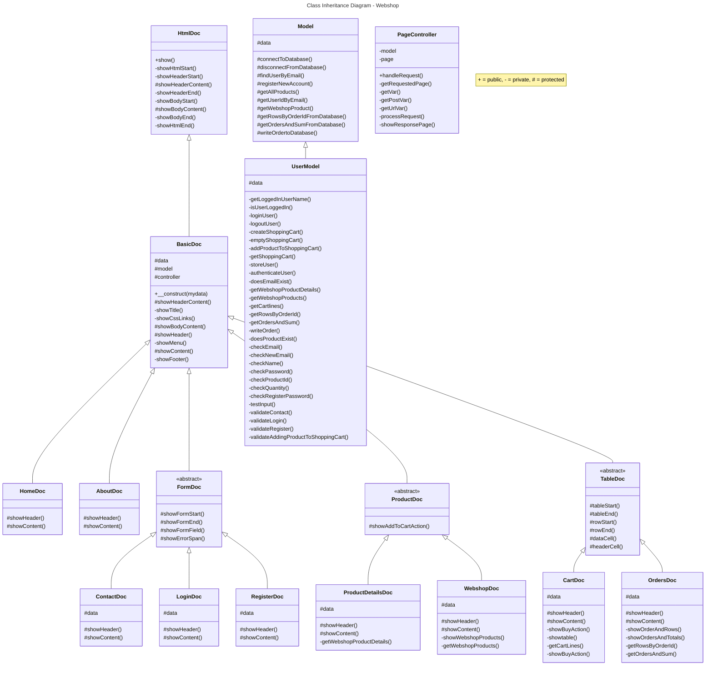

```mermaid
---
title: Class Inheritance Diagram - Webshop
---
classDiagram
    note "+ = public, - = private, # = protected"
    %% A <|-- B means that class B inherits from class A %%

    HtmlDoc <|-- BasicDoc

    BasicDoc <|-- HomeDoc
    BasicDoc <|-- AboutDoc
    BasicDoc <|-- FormDoc
    BasicDoc <|-- ProductDoc
    BasicDoc <|-- TableDoc

    FormDoc <|-- ContactDoc
    FormDoc <|-- LoginDoc
    FormDoc <|-- RegisterDoc

    ProductDoc <|-- ProductDetailsDoc
    ProductDoc <|-- WebshopDoc

    TableDoc <|-- CartDoc
    TableDoc <|-- OrdersDoc


    Model <|-- UserModel

    class PageController{
        -model
        -page
        +handleRequest()       
        -getRequestedPage()
        -getVar()
        -getPostVar()
        -getUrlVar()
        -processRequest()
        -showResponsePage()        
    }
    class Model{
        #data
        #connectToDatabase()
        #disconnectFromDatabase()
        #findUserByEmail()
        #registerNewAccount()
        #getAllProducts()
        #getUserIdByEmail()
        #getWebshopProduct()
        #getRowsByOrderIdFromDatabase()
        #getOrdersAndSumFromDatabase()
        #writeOrdertoDatabase()
    }
    class UserModel{
        #data
        -getLoggedInUserName()
        -isUserLoggedIn()
        -loginUser()
        -logoutUser()
        -createShoppingCart()
        -emptyShoppingCart()
        -addProductToShoppingCart()
        -getShoppingCart()

        -storeUser()
        -authenticateUser()
        -doesEmailExist()

        -getWebshopProductDetails()
        -getWebshopProducts()
        -getCartlines()
        -getRowsByOrderId()
        -getOrdersAndSum()
        -writeOrder()
        -doesProductExist()

        -checkEmail()
        -checkNewEmail()
        -checkName()
        -checkPassword()
        -checkProductId()
        -checkQuantity()
        -checkRegisterPassword()
        -testInput()
        -validateContact()
        -validateLogin()
        -validateRegister()
        -validateAddingProductToShoppingCart()
    }
    class HtmlDoc{
       +show()
       -showHtmlStart()
       -showHeaderStart()
       #showHeaderContent()
       -showHeaderEnd()
       -showBodyStart()
       #showBodyContent()
       -showBodyEnd()
       -showHtmlEnd()
    }
    class BasicDoc{
        #data
        #model
        #controller
        +__construct(mydata)
        #showHeaderContent()
        -showTitle()
        -showCssLinks()
        #showBodyContent()
        #showHeader()
        -showMenu()
        #showContent()
        -showFooter()
    }
    class HomeDoc{
        #showHeader()
        #showContent()
    }
    class AboutDoc{
        #showHeader()
        #showContent()
    }
    class FormDoc{
        <<abstract>>
        #showFormStart()
        #showFormEnd()
        #showFormField()
        #showErrorSpan()
    }
    class ProductDoc{
        <<abstract>>
        #showAddToCartAction()
    }
    class TableDoc{
        <<abstract>>
        #tableStart()
        #tableEnd()
        #rowStart()
        #rowEnd()
        #dataCell()
        #headerCell()
    }
    class ContactDoc{
        #data
        #showHeader()
        #showContent()
    }
    class LoginDoc{
        #data
        #showHeader()
        #showContent()
    }
    class RegisterDoc{
        #data
        #showHeader()
        #showContent()
    }
    class CartDoc{
        #data
        #showHeader()
        #showContent()
        -showBuyAction()
        -showtable()
        -getCartLines()
        -showBuyAction()
    }
    class OrdersDoc{
        #data
        #showHeader()
        #showContent()
        -showOrderAndRows()
        -showOrdersAndTotals()
        -getRowsByOrderId()
        -getOrdersAndSum()
    }
    class ProductDetailsDoc{
        #data
        #showHeader()
        #showContent()
        -getWebshopProductDetails()
    }
    class WebshopDoc{
        #data
        #showHeader()
        #showContent()
        -showWebshopProducts()
        -getWebshopProducts()
    }

```
