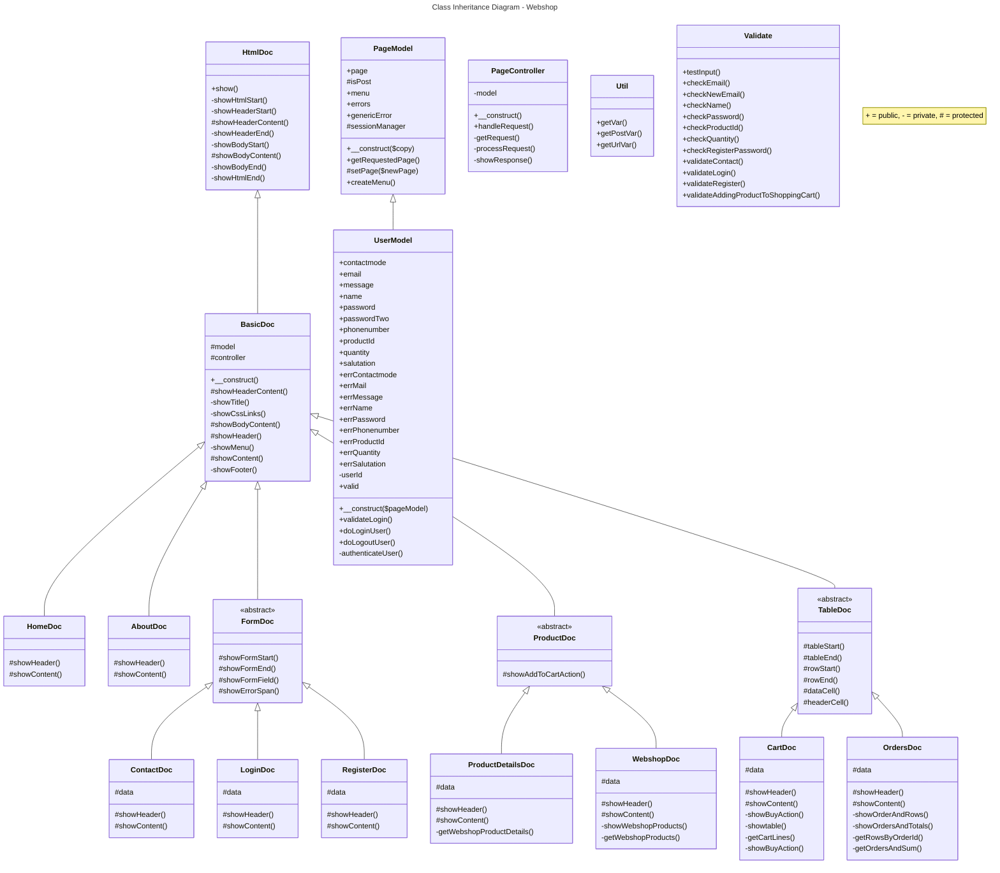

```mermaid
---
title: Class Inheritance Diagram - Webshop
---
classDiagram
    note "+ = public, - = private, # = protected"
    %% A <|-- B means that class B inherits from class A %%

    HtmlDoc <|-- BasicDoc

    BasicDoc <|-- HomeDoc
    BasicDoc <|-- AboutDoc
    BasicDoc <|-- FormDoc
    BasicDoc <|-- ProductDoc
    BasicDoc <|-- TableDoc

    FormDoc <|-- ContactDoc
    FormDoc <|-- LoginDoc
    FormDoc <|-- RegisterDoc

    ProductDoc <|-- ProductDetailsDoc
    ProductDoc <|-- WebshopDoc

    TableDoc <|-- CartDoc
    TableDoc <|-- OrdersDoc


    PageModel <|-- UserModel

    class PageController{
        -model
        +__construct()
        +handleRequest()       
        -getRequest()
        -processRequest()
        -showResponse()        
    }
    class PageModel{
        +page
        #isPost
        +menu
        +errors
        +genericError
        #sessionManager
        +__construct($copy)
        +getRequestedPage()
        #setPage($newPage)
        +createMenu()
    }
    class UserModel{
        +contactmode
        +email
        +message
        +name
        +password
        +passwordTwo
        +phonenumber
        +productId
        +quantity
        +salutation

        +errContactmode
        +errMail
        +errMessage
        +errName
        +errPassword
        +errPhonenumber
        +errProductId
        +errQuantity
        +errSalutation

        -userId
        +valid

        +__construct($pageModel)
        +validateLogin()
        +doLoginUser()
        +doLogoutUser()
        -authenticateUser()
    }
    class Util{
        +getVar()
        +getPostVar()
        +getUrlVar()
    }
    class Validate{
        +testInput()
        +checkEmail()
        +checkNewEmail()
        +checkName()
        +checkPassword()
        +checkProductId()
        +checkQuantity()
        +checkRegisterPassword()
        +validateContact()
        +validateLogin()
        +validateRegister()
        +validateAddingProductToShoppingCart()
    }
    class HtmlDoc{
       +show()
       -showHtmlStart()
       -showHeaderStart()
       #showHeaderContent()
       -showHeaderEnd()
       -showBodyStart()
       #showBodyContent()
       -showBodyEnd()
       -showHtmlEnd()
    }
    class BasicDoc{
        #model
        #controller
        +__construct()
        #showHeaderContent()
        -showTitle()
        -showCssLinks()
        #showBodyContent()
        #showHeader()
        -showMenu()
        #showContent()
        -showFooter()
    }
    class HomeDoc{
        #showHeader()
        #showContent()
    }
    class AboutDoc{
        #showHeader()
        #showContent()
    }
    class FormDoc{
        <<abstract>>
        #showFormStart()
        #showFormEnd()
        #showFormField()
        #showErrorSpan()
    }
    class ProductDoc{
        <<abstract>>
        #showAddToCartAction()
    }
    class TableDoc{
        <<abstract>>
        #tableStart()
        #tableEnd()
        #rowStart()
        #rowEnd()
        #dataCell()
        #headerCell()
    }
    class ContactDoc{
        #data
        #showHeader()
        #showContent()
    }
    class LoginDoc{
        #data
        #showHeader()
        #showContent()
    }
    class RegisterDoc{
        #data
        #showHeader()
        #showContent()
    }
    class CartDoc{
        #data
        #showHeader()
        #showContent()
        -showBuyAction()
        -showtable()
        -getCartLines()
        -showBuyAction()
    }
    class OrdersDoc{
        #data
        #showHeader()
        #showContent()
        -showOrderAndRows()
        -showOrdersAndTotals()
        -getRowsByOrderId()
        -getOrdersAndSum()
    }
    class ProductDetailsDoc{
        #data
        #showHeader()
        #showContent()
        -getWebshopProductDetails()
    }
    class WebshopDoc{
        #data
        #showHeader()
        #showContent()
        -showWebshopProducts()
        -getWebshopProducts()
    }

```
