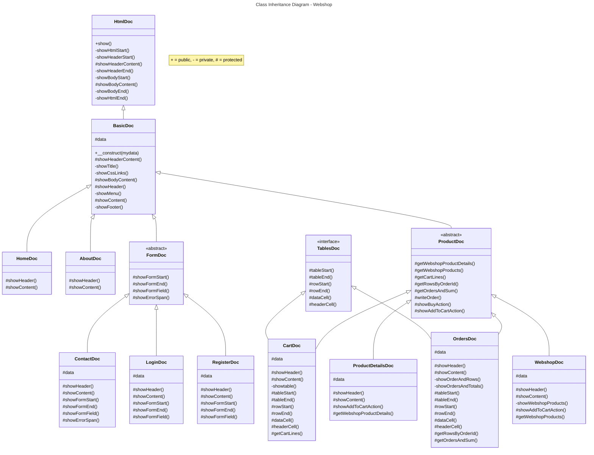

```mermaid
---
title: Class Inheritance Diagram - Webshop
---
classDiagram
    note "+ = public, - = private, # = protected"
    %% A <|-- B means that class B inherits from class A %%

    HtmlDoc <|-- BasicDoc

    BasicDoc <|-- HomeDoc
    BasicDoc <|-- AboutDoc
    BasicDoc <|-- FormDoc
    BasicDoc <|-- ProductDoc

    FormDoc <|-- ContactDoc
    FormDoc <|-- LoginDoc
    FormDoc <|-- RegisterDoc

    ProductDoc <|-- CartDoc
    ProductDoc <|-- OrdersDoc
    ProductDoc <|-- ProductDetailsDoc
    ProductDoc <|-- WebshopDoc

    TablesDoc <|-- CartDoc
    TablesDoc <|-- OrdersDoc
    
    class HtmlDoc{
       +show()
       -showHtmlStart()
       -showHeaderStart()
       #showHeaderContent()
       -showHeaderEnd()
       -showBodyStart()
       #showBodyContent()
       -showBodyEnd()
       -showHtmlEnd()
    }
    class BasicDoc{
        #data 
        +__construct(mydata)
        #showHeaderContent()
        -showTitle()
        -showCssLinks()
        #showBodyContent()
        #showHeader()
        -showMenu()
        #showContent()
        -showFooter()
    }
    class HomeDoc{
        #showHeader()
        #showContent()
    }
    class AboutDoc{
        #showHeader()
        #showContent()
    }
    class FormDoc{
        <<abstract>>
        #showFormStart()
        #showFormEnd()
        #showFormField()
        #showErrorSpan()
    }
    class ProductDoc{
        <<abstract>>
        #getWebshopProductDetails()
        #getWebshopProducts()
        #getCartLines()
        #getRowsByOrderId()
        #getOrdersAndSum()
        #writeOrder()
        #showBuyAction()
        #showAddToCartAction()
    }
    class ContactDoc{
        #data
        #showHeader()
        #showContent()
        #showFormStart()
        #showFormEnd()
        #showFormField()
        #showErrorSpan()
    }
    class LoginDoc{
        #data
        #showHeader()
        #showContent()
        #showFormStart()
        #showFormEnd()
        #showFormField()
    }
    class RegisterDoc{
        #data
        #showHeader()
        #showContent()
        #showFormStart()
        #showFormEnd()
        #showFormField()
    }
    class CartDoc{
        #data
        #showHeader()
        #showContent()
        -showtable()
        #tableStart()
        #tableEnd()
        #rowStart()
        #rowEnd()
        #dataCell()
        #headerCell()
        #getCartLines()
    }
    class OrdersDoc{
        #data
        #showHeader()
        #showContent()
        -showOrderAndRows()
        -showOrdersAndTotals()
        #tableStart()
        #tableEnd()
        #rowStart()
        #rowEnd()
        #dataCell()
        #headerCell()
        #getRowsByOrderId()
        #getOrdersAndSum()
    }
    class ProductDetailsDoc{
        #data
        #showHeader()
        #showContent()
        #showAddToCartAction()
        #getWebshopProductDetails()
    }
    class WebshopDoc{
        #data
        #showHeader()
        #showContent()
        -showWebshopProducts()
        #showAddToCartAction()
        #getWebshopProducts()
    }
class TablesDoc{
        <<interface>>
        #tableStart()
        #tableEnd()
        #rowStart()
        #rowEnd()
        #dataCell()
        #headerCell()
    }

```
